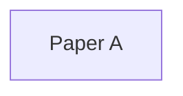

# Category Name

> Verification status: draft

## 1. Overview

### Category concept and one-sentence problem

Pending.

### Shared properties

Pending.

## 2. Overall Paper Relationships

### Recommended reading order

Pending.

## 3. Subcategory Discussion

### Subcategory: replace with the confirmed name

#### Shared everyday scenario

Pending.

#### Paper comparison

| Paper and links | Paper overview | Addition to the shared scenario | Problem solved | Evidence |
| --- | --- | --- | --- | --- |
| Pending | Pending | Pending | Pending | Pending |
