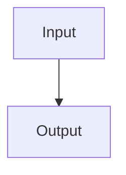

# Paper Title

> Verification status: draft

## 1. Overview

### Basic information

| Field | Value | Evidence |
| --- | --- | --- |
| Original title | Pending | [^paper-title] |
| Translated title | Pending | [^paper-title] |
| Authors | Pending | [^paper-title] |
| Year | Pending | [^paper-title] |
| Venue | Pending | [^paper-title] |
| DOI | Pending | [^paper-title] |
| arXiv ID | Pending | [^paper-title] |
| Paper ID | Pending | [^paper-title] |
| Canonical URL | Pending | [^paper-title] |
| Legal PDF URL | Pending | [^paper-title] |
| Local PDF | [Target paper PDF](target-paper.pdf) | [^paper-title] |
| Version or type | Pending | [^paper-title] |
| Category ID | Not classified | [^paper-title] |
| Subcategory ID | Not classified | [^paper-title] |

### Fields

Pending: explain the involved fields and why their combination matters in one or more explanatory-closure paragraphs.

### Reading guide

Pending: guide the reader through the paper's ideas, dependencies, and reading order in connected prose.

### Complete glossary

| Canonical term in the requested language | Paper meaning | Plain explanation | Shared-scenario analogy | Evidence |
| --- | --- | --- | --- | --- |
| Pending | Pending | Pending | Pending | Pending |

## 2. Core Content

### One-sentence problem

Pending.

### Inputs and outputs

Pending: explain the complete objects, information flow, and importance of each boundary in connected prose.

### Innovations relative to referenced work

Pending: for every paper-used novelty comparison, connect the baseline, change, and paper-stated consequence in an explanatory-closure paragraph; cite the verified local original PDF for baseline details and the target paper for its novelty framing. If no legal original full text was available after the confirmed search, label the passage "target paper's characterization only; no independent full-text comparison" and add no unverified baseline detail.

## 3. Environment and Assumptions

Pending: explain each setting or assumption, its role, supported necessity, and effect on the method or conclusion.

## 4. End-to-End Flow

### Module roles

| Module | Input | Output | Role and downstream effect | Everyday analogy |
| --- | --- | --- | --- | --- |
| Pending | Pending | Pending | Pending | Pending |

Pending: introduce the table and then explain the role, boundaries, interactions, and downstream effect of every module in connected prose.

## 5. Module Details

### Module name

Pending: explain inputs, outputs, mechanism, role, neighboring connections, and supported boundaries before presenting verified formula cards.

#### Formula card: equation name or number

Pending: insert only the exact, visually verified equation from the source PDF here. If it cannot be verified, state the content limitation and do not insert a guessed equation.

| Symbol or important term | Meaning | Everyday analogy | Role in the formula |
| --- | --- | --- | --- |
| Pending | Pending | Pending | Pending |

Pending: explain the whole equation's inputs, operation, intermediate quantity, output, meaning, and role in the module in connected prose.

Pending: explain the whole equation through the shared everyday scenario, then state where that comparison stops matching the technical content.

## 6. Experiments and Results

### Benchmark or case study

Pending: for a Benchmark, describe its origin, task, data or environment, distinctive features, and differences from the other included Benchmarks. Cite verified defining-paper PDFs for Benchmark-native facts and the target paper or supplement for the configuration used here. If a required original could not be obtained after the confirmed search, state "target paper's characterization only; Benchmark source not independently verified" and add no unverified detail.

| Parameter or setting | Value | Role in the evaluation |
| --- | --- | --- |
| Pending | Pending | Pending |

Pending: reproduce the source-faithful experiment-results and comparison table below. Put source-reported conditioning columns first when present, then Method, then every metric column in the source's order; retain metric names, units, optimization arrows, uncertainty, row groupings, and precision. Replace the illustrative columns rather than forcing them onto the source.

| Source-reported condition | Method | Source-reported metric ↑/↓ |
| --- | --- | ---: |
| Pending | Pending | Pending |

Pending: explain the relevant rows and columns, comparison, author-stated conclusion, and supported boundary in cohesive prose. For a Case Study that is not a Benchmark, adapt the structure without inventing parameter or metric tables.

## 7. Limitations and Future Work

Pending: separate and explain paper-stated limitations, demonstrated coverage boundaries, paper-stated future work, and clearly isolated external evidence.

[^paper-title]: [Target paper PDF](target-paper.pdf#page=1), p. 1.
