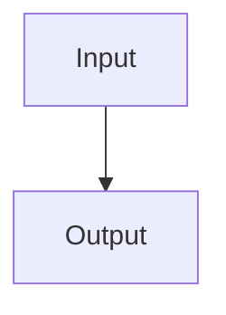

# Paper Title

> Verification status: draft

## 1. Overview

### Basic information

| Field | Value | Evidence |
| --- | --- | --- |
| Original title | Pending | [^paper-title] |
| Translated title | Pending | [^paper-title] |
| Authors | Pending | [^paper-title] |
| Year | Pending | [^paper-title] |
| Venue | Pending | [^paper-title] |
| DOI | Pending | [^paper-title] |
| arXiv ID | Pending | [^paper-title] |
| Paper ID | Pending | [^paper-title] |
| Canonical URL | Pending | [^paper-title] |
| Legal PDF URL | Pending | [^paper-title] |
| Local PDF | [Target paper PDF](target-paper.pdf) | [^paper-title] |
| Version or type | Pending | [^paper-title] |
| Category ID | Not classified | [^paper-title] |
| Subcategory ID | Not classified | [^paper-title] |

### Fields

Pending.

### Reading guide

Pending.

### Complete glossary

| Canonical term in the requested language | Paper meaning | Plain explanation | Shared-scenario analogy | Evidence |
| --- | --- | --- | --- | --- |
| Pending | Pending | Pending | Pending | Pending |

## 2. Core Content

### One-sentence problem

Pending.

### Inputs and outputs

Pending.

### Innovations relative to referenced work

Pending.

## 3. Environment and Assumptions

Pending.

## 4. End-to-End Flow

### Module roles

| Module | Input | Output | Role and downstream effect | Everyday analogy |
| --- | --- | --- | --- | --- |
| Pending | Pending | Pending | Pending | Pending |

Pending.

## 5. Module Details

### Core-equation coverage

| Original locator | Equation or result | Formula card | Included or supported omission reason |
| --- | --- | --- | --- |
| Pending | Pending | Pending | Pending |

### Module name

Pending.

#### Formula card: equation name or number

Pending.

| Symbol or important term | Meaning | Everyday analogy | Role in the formula |
| --- | --- | --- | --- |
| Pending | Pending | Pending | Pending |

Pending.

Pending.

**Overall meaning and role.** Pending.

**Shared-scenario explanation.** Pending.

**Technical boundary of the mapping.** Pending.

## 6. Experiments and Results

### Benchmark or case study

Pending.

| Parameter or setting | Value | Role in the evaluation |
| --- | --- | --- |
| Pending | Pending | Pending |

Pending.

| Source-reported condition | Method | Source-reported metric ↑/↓ |
| --- | --- | ---: |
| Pending | Pending | Pending |

Pending.

## 7. Limitations and Future Work

Pending.

[^paper-title]: [Target paper PDF](target-paper.pdf#page=1), p. 1.
