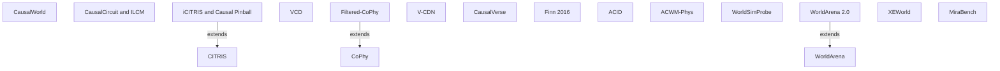

# Disconnected paper relationships

```mermaid
flowchart TB
    CausalWorld[CausalWorld]
    Brehmer[CausalCircuit and ILCM]
    CITRIS[CITRIS]
    ICITRIS[iCITRIS and Causal Pinball]
    VCD[VCD]
    CoPhy[CoPhy]
    Filtered[Filtered-CoPhy]
    VCDN[V-CDN]
    CausalVerse[CausalVerse]
    Finn[Finn 2016]
    ACID[ACID]
    ACWM[ACWM-Phys]
    Probe[WorldSimProbe]
    Arena[WorldArena]
    Arena2[WorldArena 2.0]
    XE[XEWorld]
    Mira[MiraBench]
    ICITRIS -->|extends| CITRIS
    Filtered -->|extends| CoPhy
    Arena2 -->|extends| Arena
```
