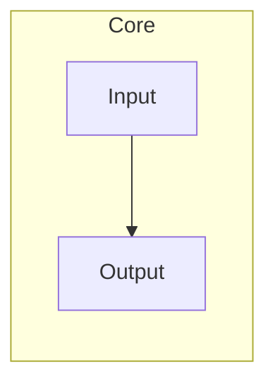

# Portable Report

## 1. Overview

The package validates inline mathematics such as $x + y$.
It also checks Unicode identifiers $α+β$, dynamic font data $\mathbb{abc}_{\text{干预}}$, and $\operatorname{rank}(A)$.

## 2. Core Content

$$
x + y = z
$$

| Symbol | Meaning | Analogy | Role in the Formula |
| --- | --- | --- | --- |
| $x$ | First value | First basket | First input |
| $y$ | Second value | Second basket | Second input |
| $z$ | Total | Combined basket | Output |
| $\vert{}S\vert{}$ | Set size | Number of baskets | Single-bar table mathematics |

## 3. Environment and Assumptions

The example has no environment assumptions.[^example]

## 4. End-to-End Flow

## 5. Module Details

- [x] The fixture includes one module.

## 6. Experiments and Results

The fixture has ~~an old~~ a current result description and reuses one source note without duplicating its definition.[^example]

## 7. Limitations and Future Work

This synthetic fixture is not a real paper.

[^example]: The footnote exists only to test the portable extension.
