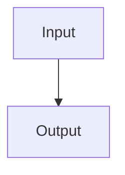

# Portable Markdown Fixture

This page verifies the locked MkDocs profile.

Inline mathematics uses $x + y = z$.

$$
x + y = z
$$

| Item | Status |
| --- | --- |
| Formula | Verified |

- [x] Task-list extension

The ~~obsolete~~ revised wording verifies strikethrough.

One sentence uses a footnote.[^fixture]

Another paragraph reuses the same footnote without defining it again.[^fixture]

[^fixture]: This is a portable footnote.
